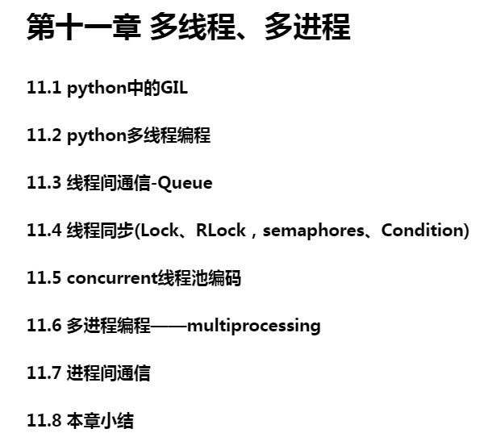
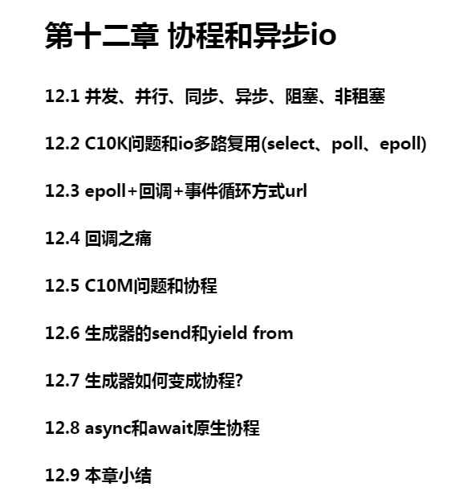
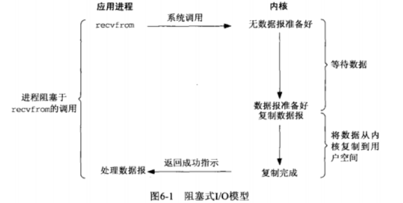
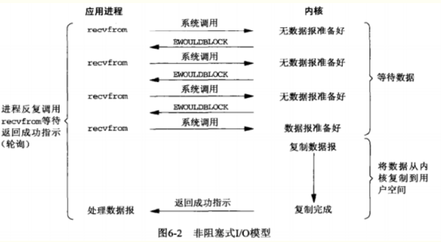
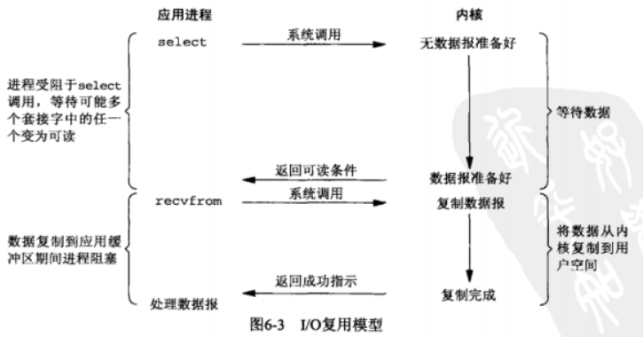
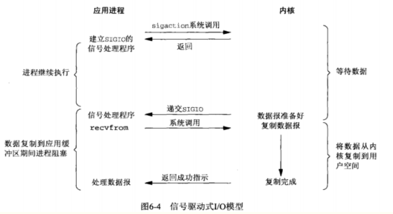
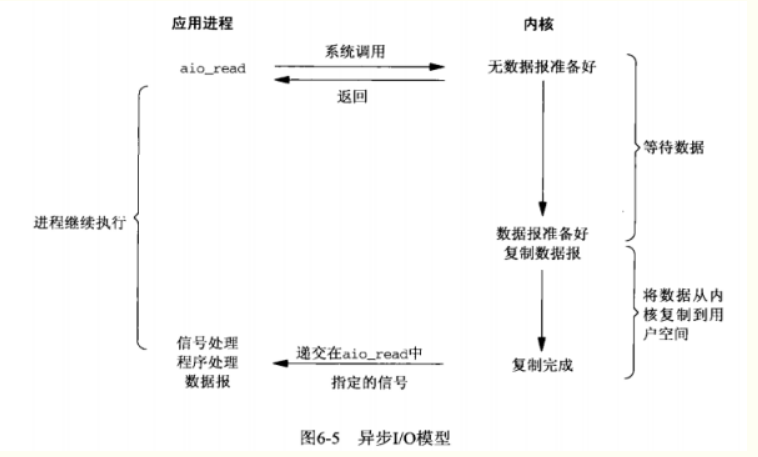
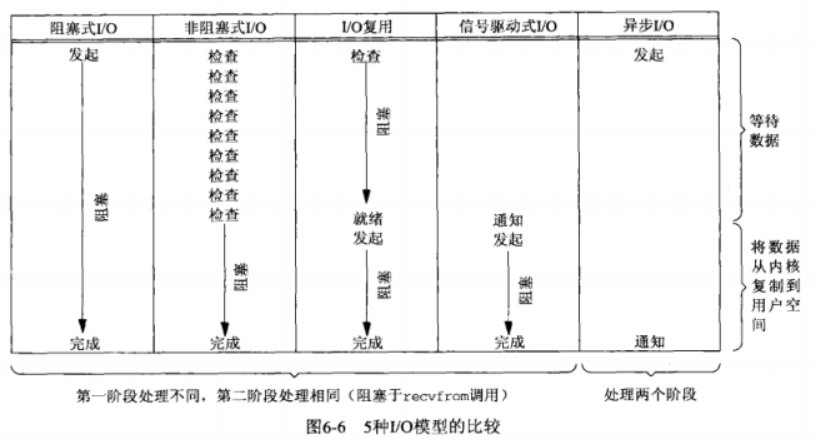

### 简要介绍

本工程主要包含一些Python的高级用法, 将会按章节来整理.

### 第11章 多线程、多进程

### 第12章 协程和异步io

- 并发: 并发是指一个**时间段内**, 有几个程序在同一个cpu上运行, 但是任意时刻只有一个程序在cpu上运行.

- 并行: 并行是指任意**时刻点上**, 有多个程序同时运行在多个cpu上.

- 同步: 同步是指代码调用IO操作时, 必须等待IO操作完成才返回的调用方式.

- 异步: 异步是指代码调用IO操作时, 不必等IO操作完成就返回的调用方式.

- 阻塞: 阻塞是指调用函数时候当前线程被挂起.

- 非阻塞: 非阻塞是指调用函数时候当前线程不会被挂起, 而是立即返回.

- C10k问题: C10k是一个在1999年被提出来的技术挑战. 如何在一颗1GHz CPU, 2G内存, 1gbps网络环境下, 让单台服务器同时为1万个客户端提供FTP服务.

- Unix下五种I/O模型
    - 阻塞式I/O
    - 非阻塞式I/O
    - I/O复用
    - 信号驱动式I/O(用的比较少)
    - 异步I/O(POSIX的`aio_`系列函数)

select允许我们同时监听多个socket, 这是与非阻塞式I/O的区别.

省了将数据从内核空间拷贝到用户空间的时间, 目前应用还不是很成熟.

select、poll、epoll都是IO多路复用的机制. I/O多路复用就是通过一种机制, 一个进程(线程)可以监控多个描述符, 一旦某个描述符就绪(一般是读就绪或者写就绪), 能够通知程序进行相应的读写操作. 但select、poll、epoll本质上都是同步I/O, 因为他们都需要在读写事件就绪后自己负责进行读写, 也就是说这个读写过程是阻塞的, 而异步I/O则无需自己负责进行读写, 异步I/O的实现会负责把数据从内核拷贝到用户空间.

**select**

select函数监视的文件描述符分3类, 分别是writefds、readfds、和exceptfds. 调用后select函数会阻塞, 直到描述符就绪(有数据可读、可写、或者except), 或者超时(timeout指定等待时间, 如果立即返回则设为null即可), 函数返回. 当select函数返回后, 可以通过遍历fdset, 来找到就绪的描述符.

select目前几乎在所有的平台上得到支持, 其良好的跨平台支持也是它的一个优点. select的一个缺点在于单个进程能够监视的文件描述符数量存在最大的限制, 在Linux上一般为1024, 可以通过修改宏定义甚至重新编译内核的方式提升这一限制, 但是这样也会造成效率的降低.

**poll**

不同于select使用三个位图来表示三个fdset的方式, poll使用一个pollfd的指针实现.

pollfd结构包含了要监视的event和发生的event, 不再使用select"参数-值"传递的方式. 同时, pollfd并没有最大数量限制(但是数量过大性能也是会下降的). 和select函数一样, poll返回后, 需要轮询pollfd来获取就绪的描述符.

从上面看, select和poll都需要在返回后, 通过遍历文件描述符来获取已经就绪的socket. 事实上, 同时连接的大量客户端在一个时刻可能只有很少的处于就绪状态, 因此随着就绪的描述符数量的增长, 其效率也会线性下降.

**epoll**

epoll是在Linux2.6内核中提出的, 是之前的select和poll的增强版本. 相对于select和poll来说, epoll更加灵活, 没有描述符限制. epoll使用一个文件描述符管理多个描述符, 将用户关系的文件描述符的事件存放到内核的一个事件表中, 这样在用户空间和内核空间的copy只需一次.

**回调之痛**

- 如果回调函数执行不正常该怎么办?

- 如果回调里面还要嵌套回调怎么办? 要嵌套很多层怎么办?

- 如果嵌套了多层, 其中某个环节出错了会造成什么后果?

- 如果有个数据需要被每个回调都处理怎么办?

- 怎么使用当前函数中的局部变量?

......

1. 可读性差

2. 共享状态管理困难

3. 异常处理困难

**C10M问题**

如何利用8核CPU, 64G内存, 在10gbps的网络上保持1000万并发连接.

面临问题:

1. 回调模式编码复杂度高

2. 同步编程的并发性不高

3. 多线程编程需要线程间同步, lock.

解决方案:

1. 采用同步的方式去编写异步的代码

2. 使用线程去切换任务:

    1. 线程是由操作系统切换的, 单线程切换意味着我们需要程序员自己去调度任务.
    
    2. 不再需要锁, 并发性高, 如果在单线程内切换函数, 性能远高于线程切换, 并发性更高.
